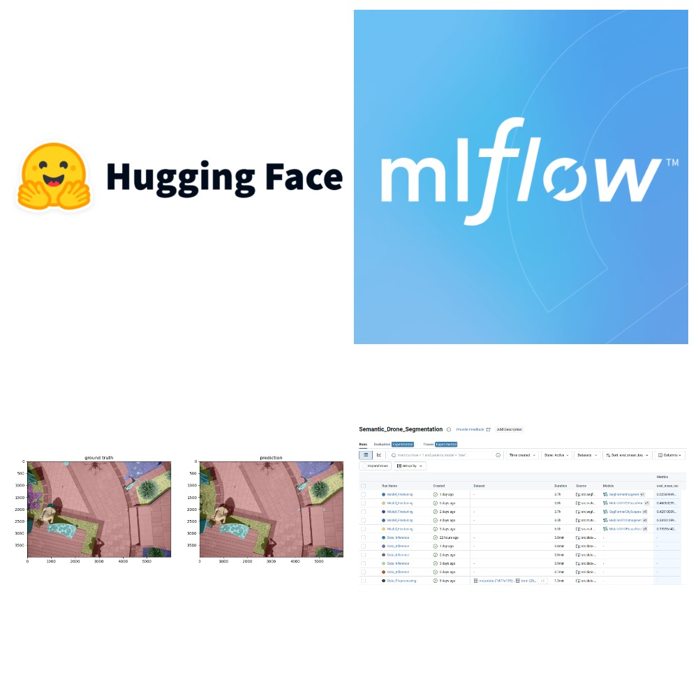

Semantic Segmentation of Drone Images With Hugging Face and MLflow 
==============================

This project demonstrates
1. the ability to finetune pretrained state-of-the-art segmentation models for given task with HuggingFace Transformers writing minimal amount of code;
2. the way to integrate the Transformers library with MLflow for model tracking and benchmarking in case of segmentation task.

## Benchmark results

The results can be viewed and obtain in MLflow UI after finishing all necesarry runs.

|   | Model       | Backbone                                         | Mean IoU |
|---|-------------|--------------------------------------------------|----------|
| 1 | SegFormer   | nvidia/mit-b0                                    | 0.53     |
| 2 | MobileViTV2 | apple/mobilevitv2-1.0-voc-deeplabv3              | 0.46     |
| 3 | SegFormer   | nvidia/segformer-b0-finetuned-cityscapes-768-768 | 0.43     |
| 4 | MobileViTV2 | apple/mobilevitv2-1.0-imagenet1k-256             | 0.33     |
| 5 | MobileViT   | apple/deeplabv3-mobilevit-small                  | 0.19     |

## Usage

### MLflow installation

The first step is ensuring that MLflow is installed on your system. It is recommended to use Python version >= 3.8.

```
pip install requirements.txt
```

### Download the dataset

Download Semantic Segmentation Drone Dataset by following link https://www.kaggle.com/datasets/santurini/semantic-segmentation-drone-dataset and unzip it into data folder.

### Run Data Preprocessing step

Run data preprocessing step. If you run it for the first time, mlflow creates conda enviroment required for subsequent steps.

```
mlflow run src --entry-point data-preprocessing --env-manager conda --experiment-name Semantic_Drone_Segmentation --run-name Data_Preprocessing -P config-path='../config/data.yaml'
```

### Run Finetuning

Currently 3 models are supported in this project (SegFormer, MobileViT, MobileViTV2), each model has its own finetuning script in src folder and several configuration files in config folder with different parameters including backbone name. 

```
mlflow run src --entry-point <model-finetuning> --env-manager conda --experiment-name Semantic_Drone_Segmentation --run-name Model_Finetuning -P config-path=<path-to config>
```

As `<model-finetuning>`, you can use following entry points:
- `segformer-finetuning`
- `mvt-finetuning`
- `mvtv2-finetuning`

Example:

```
mlflow run src --entry-point segformer-finetuning --env-manager conda --experiment-name Semantic_Drone_Segmentation --run-name Model_Finetuning -P config-path='../config/segformer_imagenet.yaml'
```

While finetuning the model, all losses and metrics are logged and you can track them in MLflow UI. In the end finetuned model will be logged and registred.

You can add new configuration files as well as new models. For the last option, you have to write new finetunung script, add corresponding entry point to `src/MLproject` file and make configuration file in config folder.

### Run Inference

Additionally you can run inferece on several samples in test dataset after the model is finetuned.

```
mlflow run src --entry-point data-inference --env-manager conda --experiment-name Semantic_Drone_Segmentation --run-name Data_Inference -P config-path=<path-to config>
```

Example:

```
mlflow run src --entry-point data-inference --env-manager conda --experiment-name Semantic_Drone_Segmentation --run-name Data_Inference -P config-path='../config/segformer_imagenet.yaml'
```

The prediction samples can be viewed in MLflow UI. Open corresponding run and click on `Artifacts`.

### MLflow UI

Run following command and open the link http://127.0.0.1:5000 in your browser:

```
mlflow ui
```

Choose `Semantic_Drone_Segmentation` amoung experiments and you will see a summary table with all launched runs. To benchmark the models, click `Show more columns` and then choose `eval_mean_iou`.

Project Organization
------------

    ├── README.md                       <- The top-level README for developers using this project.
    │
    ├── config                          <- Config folder
    │
    ├── data                            <- Data folder
    │
    ├── mlruns                          <- Folder storing info and artifacts of all launched runs
    │
    ├── src                             <- Source code for use in this project.
    │   ├── __init__.py                 <- Makes src a Python module
    │   │
    │   ├── conda.yaml                  <- Conda enviroment configuration file  
    │   │
    │   ├── MLproject                   <- MLproject file
    │   │
    │   ├── data.py                     <- Tools for data manipulation
    │   │
    │   ├── data_preprocessing.py       <- Script used for data preprocessing runs 
    │   │
    │   ├── data_inference.py           <- Script used for inference runs 
    │   │
    │   ├── model.py                    <- Tools for modeling
    │   │
    │   ├── mvt_finetuning.py           <- Script used for MobileViT finetuning runs 
    │   │
    │   ├── mvtv2_finetuning.py         <- Script used for MobileViTV2 finetuning runs 
    │   │
    │   ├── segformer_finetuning.py     <- Script used for SegFormer finetuning runs 
    │   │
    │   ├── utils.py                    <- Helper hunctions
    │   │
    │   └── visualization.py            <- Tools to create exploratory and results
    │                                      oriented visualizations 
    │   
    └── requirements.txt                <- The requirements file for reproducing the
                                           analysis environment, e.g.
                                           generated with `pip freeze > requirements.txt`

## References

The way to organize experiments and runs in MLflow is based on following code: https://github.com/egorborisov/mlflow_example.